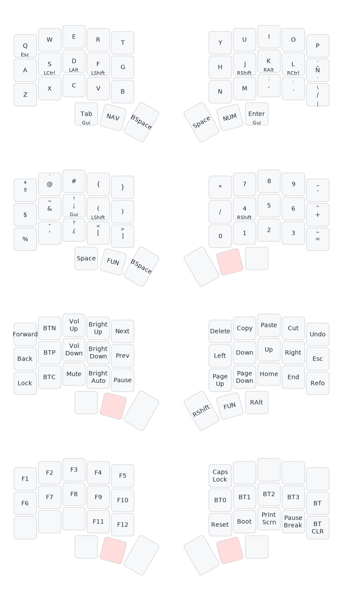

# Config
ZMK config for a chocofi or corne, 36 split keyboard, designed for use with spanish layout.
# Keymap
Ilustrations web [Keymap-drawer](https://caksoylar.github.io/keymap-drawer?keymap_yaml=H4sIAAAAAAAC_5VTyXITMRC98xWNWMKikNhOSGJWb5MAjhO8BEIIZmIrscuT0TCjIXGF4R_4BG4UxZETF6rMj9GtkcamkirgoJb0uvvpqVvy3LGMVfESwLvjUXckxgfSDftF6MnQF91QKleJvvF6aSzUS7tbnXY3Cryh6hZOl7uFS-gSYUQ01ZpDE8A87J0NilCLehww6XnC4QWHGocmhzaHXQ4dDk84bHHY3rcZJQ6UVK-o0NNprcQgJU9poGqB1mB4mEIOQuscNlJHc-p4amKbNvmZBTL-ukHY5DvTwK9PHCLaf2FJJusVh5ccKhx2OJQ5NDhsYhpGM87S8HssMcgdgxQtsqD3rznQMR-mrHTsejzUp7bdg8TAjdKOWZVbgdsTZjO7bnQ2L-Co-UqExILuaQvQMfmhFUy-WomPjcS3JJFdwR07I5OQuUVmhcwqmTVmkuZNUnemLuyq9V5PvZNv9ozJZxN_membo0rrupEiaQdJwU06aMFSLaXupnUvc7hrXLdTzjczCq7ZtLnUN8fmMgk_jYRHWXP2DHI_Q_YN8lDXYpGU5MjkyRQs-QMT9XF6-dmGOJ3GRT3zY8-zjVLjQBRhILx-8qcX-511y5HhCX4_fGRtfGNsR3rQCUhIORweDZTZNMSpwrkqPKEEPksZjPEPuZHexPjSO35fZhUqu70REW4bwqo88Wco7XY7FO9xrgv6OwQiTYCflYI4_eKMsC5TQvwObDNWYoasFCupydw4EuniSBjVemlO25DHqLXm402b4jDT-k_1omX6Ns4Vn_45LhGYVjTHwcnjKOBYwoGviVXcIAK6Bkoh1vM2u6yDT89ZwbGKYw1HbpHurk2OTJ5MgUyWc57SyZGMXJ6uGwmsZ1lKpYs-9BW0eqGfVQ3KoXBHuqZtqNSb7L-L8_fA34txKUX1BQAA)

# Inspiration
- [Chocofi layout](https://github.com/edygar/chocofi-zmk-config/tree/main?tab=readme-ov-file)
